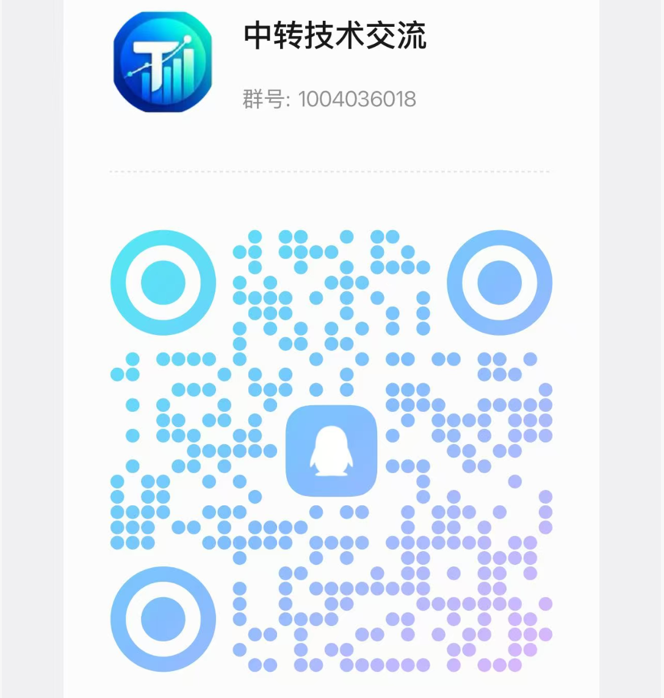
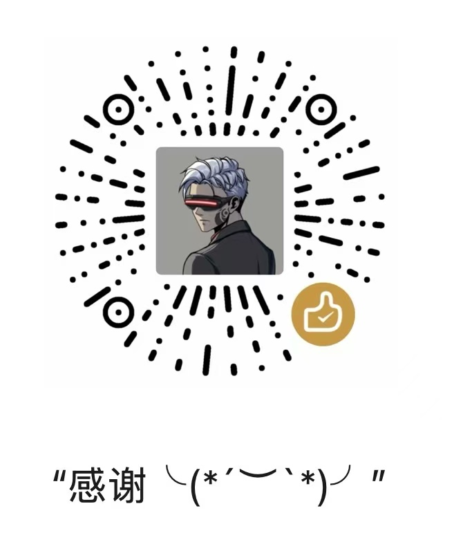

# Codebot

**AI API Gateway Platform for Subscription Quota Distribution**

English | [中文](README_CN.md) | [日本語](README_JA.md)

> This branch also includes a configurable public transit data page, mutually exclusive V1/V2 monitoring views, and a unified public snapshot API. See the [Chinese integration and production deployment guide](README_PUBLIC_TRANSIT_CN.md) for ready-to-use Agent prompts.

## ⚠️ Important Notice

<table>
<tr>
<td align="center" width="50%">
  
   
  加入 QQ 群「中转技术交流」
</td>
<td align="center" width="50%">
  
   
  如果帮到大家可以打赏咖啡！
</td>
</tr>
</table>

- **🚨 Terms of Service Risk**: Using this project may violate the terms of service of Anthropic and other upstream providers. Please review the relevant providers' user agreements before use; all risks arising from such use are borne solely by the user.
- **⚖️ Compliant Use**: Use this project only in compliance with the laws and regulations of your country or region. Any unlawful use is strictly prohibited.
- **📖 Disclaimer**: This project is provided for technical learning and research purposes only. The authors assume no liability for account bans, service interruptions, data loss, or any other direct or indirect damages resulting from the use of this project.
- **🚫 No Commercial Authorization**: The developers of this project have never authorized any individual or organization to conduct any form of commercial operation based on this project. Any commercial activity conducted in the name of or based on this project is unrelated to this project and its developers, and all resulting disputes, losses, and legal liabilities shall be borne solely by the party conducting such activity.

## ❤️ Sponsors

> [Want to appear here?](mailto:support@sub2api.org)

<table>

<tr>
<td width="180"></td>
<td>Thanks to CCTK.AI for sponsoring this project! <a href="https://cctk.ai/register?aff=SUB2API">CCTK.AI</a> is an AI API gateway focused on stability and cost-effectiveness, offering fast relay services for Claude, OpenAI, Gemini, and other popular models. It works seamlessly with Claude Code, Codex, and other mainstream coding tools, delivering the same model capabilities at a fraction of the official cost. Register via <a href="https://cctk.ai/register?aff=SUB2API">this link</a> for faster, more stable, and more affordable AI API access.</td>
</tr>

<tr>
<td width="180"></td>
<td>One API, every top model! <a href="https://www.openmodel.ai?ref=sub2api">OpenModel</a> is a production-grade, high-availability AI API gateway that makes your applications truly fast and stable: automatic failover, smart routing to the best-performing channel, and a production-grade SLA. An SLA that far surpasses any single provider — making stability your core competitive advantage. Works directly with Claude Code, Codex, and Gemini CLI. Register via this link to get started.</td>
</tr>

<tr>
<td width="180"></td>
<td>Thanks to ETok.ai for sponsoring this project! ETok.ai is dedicated to building a one-stop AI programming tool service platform. We offer professional Claude Code packages and technical community services, with support for Google Gemini and OpenAI Codex. Through carefully designed plans and a professional tech community, we provide developers with reliable service guarantees and continuous technical support, making AI-assisted programming a true productivity tool. Click <a href="https://etok.ai">here</a> to register!</td>
</tr>

<tr>
<td width="180"></td>
<td>Thanks to APIKEY.FUN for sponsoring this project! <a href="https://apikey.fan/register?aff=SUB2API">APIKEY.FUN</a> is one of the core contributors to the sub2api open-source project, dedicated to providing open, stable, and cost-effective AI API access. The platform supports API relay services for Claude, OpenAI, Gemini, and other popular models, with pricing starting from as low as 7% of the original rate. Register via the exclusive link: <a href="https://apikey.fan/register?aff=SUB2API">APIKEY</a> to enjoy up to 5% off on all recharges.</td>
</tr>

<tr>
<td width="180"></td>
<td>Thanks to AIGoCode for sponsoring this project! AIGoCode is an all-in-one platform that integrates Claude Code, Codex, and the latest Gemini models, providing you with stable, efficient, and highly cost-effective AI coding services. The platform offers flexible subscription plans, zero risk of account suspension, direct access with no VPN required, and lightning-fast responses. AIGoCode has prepared a special benefit for sub2api users: if you register via <a href="https://aigocode.com/invite/SUB2API">this link</a>, you'll receive an extra 10% bonus credit on your first top-up!</td>
</tr>

<tr>
<td width="180"></td>
<td>Real GPT-5.6 series at 3% of OpenAI pricing — <a href="https://codex-everywhere.com">CodexEverywhere</a> is democratizing access to frontier models for developers worldwide. We believe in transparency and honesty, with model quality verified by active community oversight for months. USD and crypto friendly. Start with a free $20 trial at <a href="https://codex-everywhere.com">codex-everywhere.com</a>.</td>
</tr>

| 组件 | 技术 |
|------|------|
| 后端 | Go 1.27.0, Gin, Ent |
| 前端 | Vue 3.4+, Vite 5+, TailwindCSS |
| 数据库 | PostgreSQL 15+ |
| 缓存/队列 | Redis 7+ |
| API 协议 | OpenAI Responses / Chat Completions、Anthropic Messages、Gemini、SSE、WebSocket |
| 调度与可靠性 | 粘性会话、并发控制、限流、故障转移、ticket 准入与冷却 |
| 观测与运维 | 结构化日志、请求分段耗时、健康检查、Mihomo 出口与 systemd |
| 交付与质量 | Docker Compose、GitHub Actions、Go 单元测试、前端类型检查与构建 |

## 贡献与协作

欢迎围绕协议兼容、账号调度、Codex ticket、支付计费、管理后台和运维观测提交改进。高质量贡献应尽量保持边界清晰，并在 PR 中说明请求路径、状态变化、兼容性影响和验证证据。

建议按以下方式提交：

- **协议与网关**：补充请求/响应样例，覆盖流式终止、工具调用、重试和上游错误映射。
- **调度与账号**：说明候选筛选、粘性状态、并发占用、冷却窗口和故障转移行为，避免改变幂等语义。
- **后台与配置**：同步前后端类型、默认值、权限边界和迁移兼容性。
- **运维与部署**：提供离线或 mock 验证，不在 PR 中写入 Token、ticket、代理凭据或生产配置。
- **验证与审查**：列出实际运行的测试、构建或脚本检查；未运行的检查不要标记为通过。

感谢已合并 PR 的贡献者：

  
  
  
  
  
  
  

---

## Star History

<a href="https://star-history.dera.page/#Wei-Shaw/sub2api&Date">
 <picture>
   <source media="(prefers-color-scheme: dark)" srcset="https://star-history.dera.page/svg?repos=Wei-Shaw/sub2api&type=Date&theme=dark" />
   <source media="(prefers-color-scheme: light)" srcset="https://star-history.dera.page/svg?repos=Wei-Shaw/sub2api&type=Date" />
   
 </picture>
</a>

---

## License

This project is licensed under the [GNU Lesser General Public License v3.0](LICENSE) (or later).

Copyright (c) 2026 Wesley Liddick

---

**If you find this project useful, please give it a star!**

